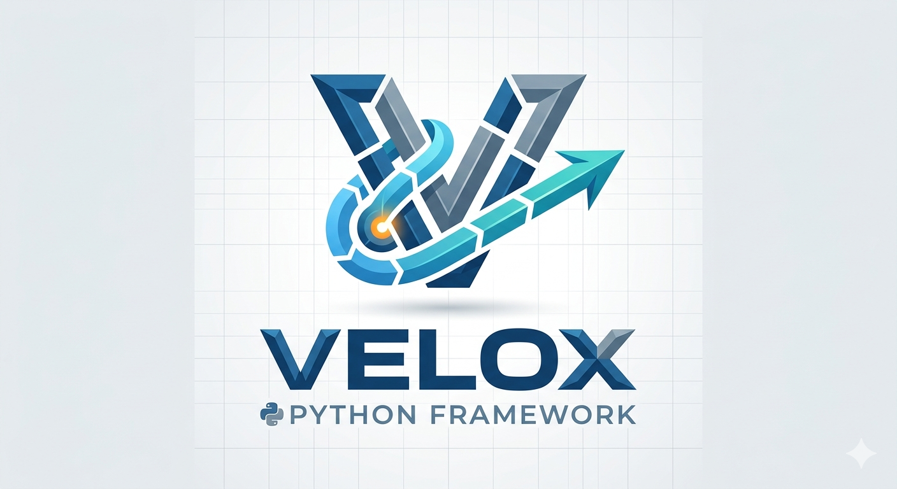

Documentação do Velox Framework
================================

**Velox — Fast Python Web Framework — WSGI + ASGI, zero dependencies**

Velox é um framework Python web extremamente rápido sem dependências obrigatórias.
Suporta ambos os modos:

- **WSGI/Threading** — Execute sem dependências externas
- **ASGI/uvicorn** — Suporte async com uvicorn

.. toctree::
   :maxdepth: 2
   :caption: Começando

   installation
   quickstart
   project_structure
   configuration

.. toctree::
   :maxdepth: 2
   :caption: Rotas e URLs

   routing

.. toctree::
   :maxdepth: 2
   :caption: Banco de Dados

   database

.. toctree::
   :maxdepth: 2
   :caption: Templates

   templates

.. toctree::
   :maxdepth: 2
   :caption: Arquivos Estáticos

   static_files

.. toctree::
   :maxdepth: 2
   :caption: Segurança

   auth

.. toctree::
   :maxdepth: 2
   :caption: API Reference

   api

Por que usar Velox?
-------------------

- **Zero Dependencies** — Sem pacotes externos para uso básico
- **Blazing Fast** — Otimizado para performance
- **Sync + Async** — Misture handlers sync e async no mesmo app
- **Modular** — Use Blueprints para organizar rotas
- **WebSocket** — Suporte WebSocket nativo (modo ASGI)
- **Pythonic** — API limpa e intuitiva
- **ORM Integrado** — Banco de dados com Model e Query Builder
- **Templates Poderosos** — Herança, macros, filtros
- **Arquivos Estáticos** — Servir CSS, JS, imagens

Exemplo Rápido
--------------

.. code-block:: python

   from velox import Velox

   app = Velox(__name__)

   @app.get('/')
   def home(req, res):
       return app.render('index.html', {'nome': 'Mundo'})

   @app.get('/api/dados')
   async def api(req, res):
       data = await buscar_dados()
       res.json(data)

   app.run()

Instalação
----------

.. code-block:: bash

   pip install velox-web

Ou com extras:

.. code-block:: bash

   pip install velox-web[asgi]    # Com uvicorn
   pip install velox-web[full]   # Todas features
   pip install velox-web[dev]  # Desenvolvimento

Links
-----

- `GitHub <https://github.com/Barros1915/velox>`_
- `PyPI <https://pypi.org/project/velox-web/>`_
- `Report Issues <https://github.com/Barros1915/velox/issues>`_

Índices e tabelas
=================

* :ref:`genindex`
* :ref:`modindex`
* :ref:`search`